Javascript로 웹게임 만들기 - by ZeroCho

## 1. 끝말잇기

> 끝말잇기 쿵쿵따게임.  
> 게임인원수는 게임시작시 설정가능하고, 3글자 단어를 올바르게 넣어야한 통과.

- 게임인원수 설정

  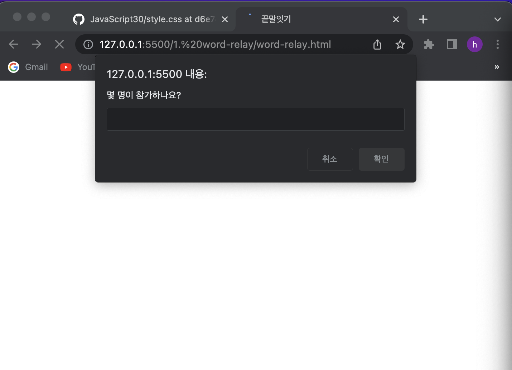

- 제시한 단어가 3글자가 아닐경우 에러메세지

  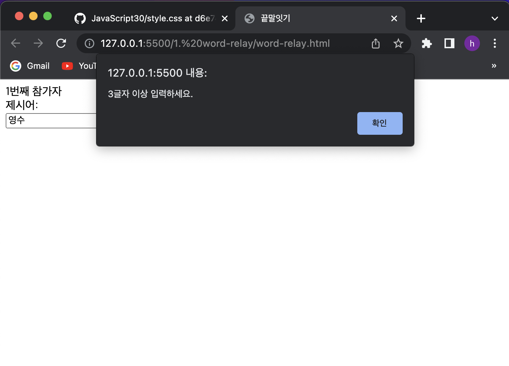

- 제시간 단어가 올바르지 않을 경우 에러메세지

  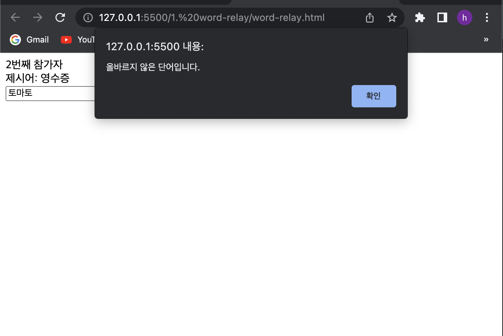

- 게임참여자 순번 표시하기

```js
const order = parseInt(orderNumber.textContent)
if (order + 1 > number) {
  orderNumber.textContent = 1
} else {
  orderNumber.textContent = order + 1
}
```

---

## 2. 계산기

> 간단 계산기 만들기
>
> - 숫자를 넣지 않으면, 에러메세지생성
> - 연달아 계산 가능

- 계산기

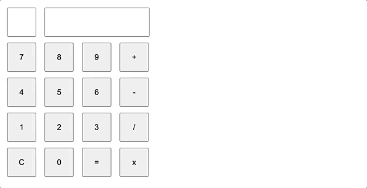

---

## 3. 숫자야구게임

> 상대편이 숫자 1~9중에서 중복되지 않게 4개를 고른다. 10번의 기회가 주어지고, 상대편이 고른 숫자 4개를 맞추는 게임.  
> 틀릴때마다 힌트가 주어지는데, 맞힌 숫자의 개수(볼), 숫자뿐만 아니라 순서가 맞힌 개수(스트라이크), 틀린 개수(아웃)를 알려줍니다.

### 1. 무작위로 숫자 4개 뽑기(Math.random)

```js
const answer = []
for (let n = 0; n < 4; n += 1) {
  const index = Math.floor(Math.random() * numbers.length)
  answer.push(numbers[index])
  numbers.splice(index, 1)
}
```

### 2. 입력된 값 검사

1. 입력된 값이 4자리인지
2. 중복되는 숫자가 있는지
3. 이미 시도한 값은 아닌지

```js
function checkInput(input) {
  if (input.length !== 4) {
    return alert('4자리 숫자를 입력해주세요.')
  }
  if (new Set(input).size !== 4) {
    return alert('중복되지 않게 입력해주세요.')
  }
  if (tries.includes(input)) {
    return alert('이미 시도한 값입니다.')
  }
  return true
}
```

### 3. 스트라이크, 볼, 아웃으로 힌트를 준다. 맞추면 홈런!, 3아웃 이나 10회 동안 맞추지 못하면 패배!

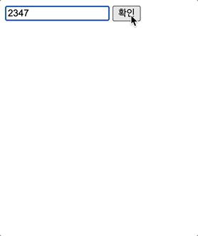

---

## 4. LOTTO

> 타이머를 사용하여 로또추첨기 만들기  
> 랜덤으로 숫자를 골라서 6개의 당첨숫자와 1개의 보너스 숫자를 보여주기

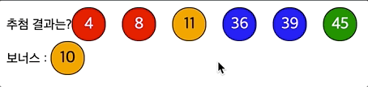

- 45개의 공이 랜덤하게 섞여서 배열되도록 하고, 하나씩 가져오는 방식 => Fisher-Yates Shuffle 방식

```js
  const shuffle = []; //45개의 공이 랜덤하게 섞여서 배열되도록 한다.
  while (candidate.length > 0) {
	const random = Math.floor(Math.random() * candidate.length); //무작위 인덱스 뽑기
	const spliceArray = candidate.splice(random, 1); //뽑은 값은 배열에 들어 있음
	const value = spliceArray[0]; //splice로 반환된 배열에 들어있는 값을 꺼내어
	shuff
```

- 나열된 45개의 공에서 6개의 당첨숫자와 1개의 보너스 숫자 뽑기
  - sort를 이용 오름차순으로 정렬하기

```js
const winBall = shuffle.slice(0, 6).sort((a, b) => a - b)
const bonus = shuffle[6]
```

---

## 4. 가위바위보

> 컴퓨터의 가위바위보 손이 빠르게 돌아가게 하고, 버튼을 눌러 내 가위바위보를 내면 멈춰서 누가 이겼는지 확인.

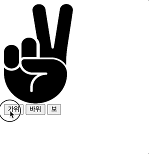

- 가위바위보 규칙찾기  
  가위: 1, 바위: 0, 보: -1로 생각하고 내가 낸 것과 컴퓨터가 낸 두값의 차이로 공통규칙 찾아내기

```js
const myScore = scoreTable[myChoice]
const computerScore = scoreTable[computerChoice]
const diff = myScore - computerScore
```

| 나\컴퓨터 | 가위 | 바위 | 보  |
| --------- | ---- | ---- | --- |
| 가위      | 0    | 1    | 2   |
| 바위      | -1   | 0    | 1   |
| 보        | -2   | -1   | 0   |

```js
let message
if (diff === -1 || diff === 2) {
  myTotal += 1
  message = '승리'
} else if (diff === 1 || diff === -2) {
  computerTotal += 1
  message = '패배'
} else {
  message = '무승부'
}
```

---

## 5. 반응 속도 테스트

> 반응속도가 얼마나 빠른지 확인하는 반응속도 테스트 프로그램.  
> 파랑화면 - 대기화면, 빨강화면 - 준비화면, 초록화면 - 초록 화면을 보자마자 클릭하면 초록 화면이 뜬 시각과 클릭한 시각의 차이를 구해 반응속도를 측정

- 반응 속도 측정하기


```js
new Date()
```

new Date()를 사용하여 시작 시각과 종료 시각을 측정해서 서로 뺀다.

- 평균 반응 속도 구하기

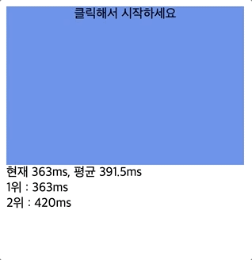

```js
const records = [];
...
const average = records.reduce((a, c) => a + c) / records.length;
```

_records_ 라는 배열을 만들어 반응속도를 기록하고, _reduce_ 라는 배열의 메서드를 사용해서 평균값 구하기

- 성급한 클릭 막기

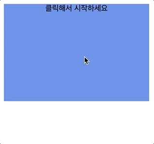

```js
clearTimeout(timeoutId)
```

준비 화면(빨강)일 때 클릭한다면 성급했다는 메시지가 나오고 다시 클릭하도록 대기 화면(파랑)으로 보냄.

clearTimeout을 사용하여 타이머가 필요없을때는 없애줌

## 6. tic-tac-toe 게임

> 오목의 축소판인 삼목게임으로, 바둑판이 아니라 3 × 3 표 위에서 진행 (이차원 배열로 표현).
> 바둑에 검은 돌과 흰 돌이 있듯이 틱택토에는 O와 X가 있다.

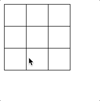

- 이차원배열
- rowIndex와 cellIndex 사용하여 몇번째 줄, 칸인지 확인
- 무승부검사 - flat, every  
  flat() 일차원 배열로 만들고, every로 모든 조건 함수가 true면 true, 하나라도 false면 false

```js
const draw = rows.flat().every((cell) => cell.textContent)
if (draw) {
  $result.textContent = '무승부'
  return
}
```

## 8. concentration game - 카드 맞추기

> 짝 맞추기 게임. 모든 카드의 색을 보여 주며 잠깐 동안 카드 짝을 외울 수 있는 시간을 주고 나서, 카드를 다시 전부 뒤집은 뒤 짝을 맞추게 하는 게임.

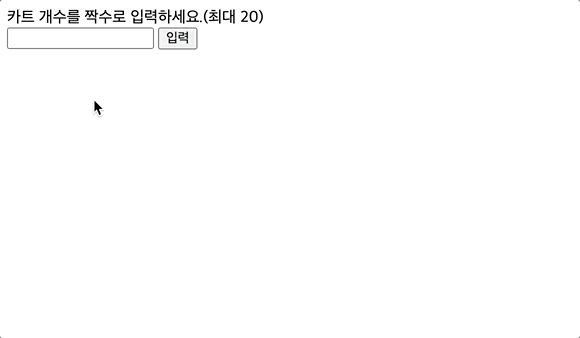

1. 카드 개수 입력하기

   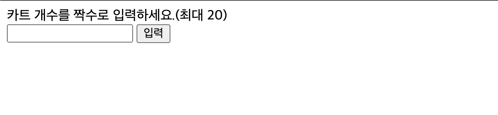

2. 클릭막기  
   버그를 해결하기 위해 카드를 클릭할 수 있는 상황과 클릭할 수 없는 상황을 구분 => clickable 변수 선언

```js
let clickable = false;

function onClickCard() {
	//1. 처음에 카드가 공개되는 동안 클릭막기.
	//2. 12장의 카드가 다 맞으면 클릭막기
	//3. 방금 클릭한 카드 재클릭 막기
	if (!clickable || completed.includes(this) || clicked[0] === this) {
		return;
	}
```

3. 게임 리셋하기 - 카드가 다 맞춰지면 게임 리셋

```js
function resetGame() {
  $wrapper.innerHTML = ''
  colorCopy = colors.concat(colors)
  shuffled = []
  completed = []
  clickable = false
  startGame()
}
```

---
